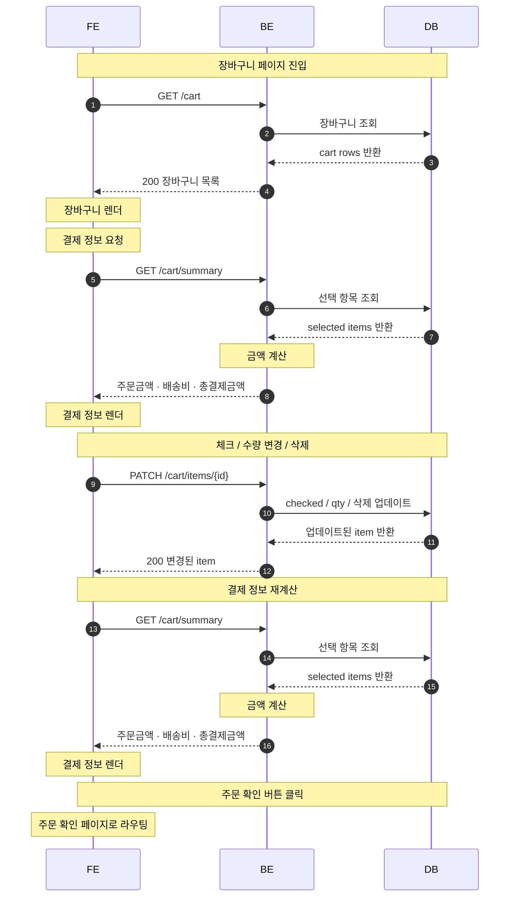
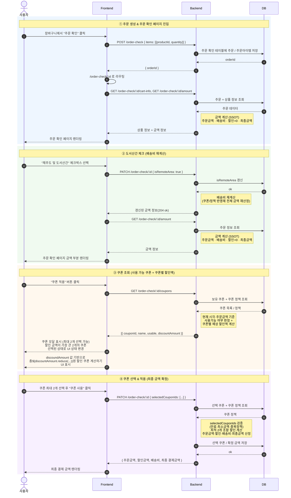

```mermaid
sequenceDiagram
  autonumber
  participant FE
  participant BE
  participant DB

  Note over FE,DB: 장바구니 페이지 진입

  FE->>BE: GET /cart
  BE->>DB: 장바구니 조회
  DB-->>BE: cart rows 반환
  BE-->>FE: 200 장바구니 목록
  Note over FE: 장바구니 렌더

  Note over FE: 결제 정보 요청
  FE->>BE: GET /cart/summary
  BE->>DB: 선택 항목 조회
  DB-->>BE: selected items 반환
  Note over BE: 금액 계산
  BE-->>FE: 주문금액 · 배송비 · 총결제금액
  Note over FE: 결제 정보 렌더

  Note over FE,DB: 체크 / 수량 변경 / 삭제

  FE->>BE: PATCH /cart/items/{id}
  BE->>DB: checked / qty / 삭제 업데이트
  DB-->>BE: 업데이트된 item 반환
  BE-->>FE: 200 변경된 item

  Note over FE,DB: 결제 정보 재계산

  FE->>BE: GET /cart/summary
  BE->>DB: 선택 항목 조회
  DB-->>BE: selected items 반환
  Note over BE: 금액 계산
  BE-->>FE: 주문금액 · 배송비 · 총결제금액
  Note over FE: 결제 정보 렌더

  Note over FE,DB: 주문 확인 버튼 클릭

  Note over FE: 주문 확인 페이지로 라우팅
```

```mermaid
sequenceDiagram
    autonumber
    actor U as 사용자
    participant FE as Frontend
    participant BE as Backend
    participant DB as DB

    rect rgb(238, 246, 255)
    Note over U,DB: ① 주문 생성 & 주문 확인 페이지 진입
    U->>FE: 장바구니에서 "주문 확인" 클릭
    FE->>BE: POST /order-check { items: [{productId, quantity}] }
    BE->>DB: 주문 확인 테이블에 주문 / 주문아이템 저장
    DB-->>BE: orderId
    BE-->>FE: { orderId }
    FE->>FE: /order-check/:id 로 라우팅
    FE->>BE: GET /order-check/:id/cart-info, GET /order-check/:id/amount
    BE->>DB: 주문 + 상품 정보 조회
    DB-->>BE: 주문 데이터
    Note right of BE: 금액 계산 (SSOT)<br/>주문금액 · 배송비 · 할인=0 · 최종금액
    BE-->>FE: 상품 정보 + 금액 정보
    FE-->>U: 주문 확인 페이지 렌더링
    end

    rect rgb(240, 250, 240)
    Note over U,DB: ② 도서산간 체크 (배송비 재계산)
    U->>FE: "제주도 및 도서산간" 체크박스 선택
    FE->>BE: PATCH /order-check/:id { isRemoteArea: true }
    BE->>DB: isRemoteArea 갱신
    DB-->>BE: ok
    Note right of BE: 배송비 재계산<br/>(쿠폰/정책 반영해 전체 금액 재산정)
    BE-->>FE: 갱신된 금액 정보(204 ok)
		FE-->>BE: GET /order-check/:id/amount
    BE->>DB: 주문 정보 조회
		Note right of BE: 금액 계산 (SSOT)<br/>주문금액 · 배송비 · 할인=0 · 최종금액
    BE-->>FE: 금액 정보
    FE-->>U: 주문 확인 페이지 금액 부분 렌더링
    end

    rect rgb(255, 248, 238)
    Note over U,DB: ③ 쿠폰 조회 (사용 가능 쿠폰 + 쿠폰별 할인액)
    U->>FE: "쿠폰 적용" 버튼 클릭
    FE->>BE: GET /order-check/:id/coupons
    BE->>DB: 보유 쿠폰 + 쿠폰 정책 조회
    DB-->>BE: 쿠폰 목록 / 정책
    Note right of BE: 현재 시각·주문금액 기준<br/>사용가능 여부 판정 +<br/>쿠폰별 예상 할인액 계산
    BE-->>FE: [{ couponId, name, usable, discountAmount }]
    FE-->>U: 쿠폰 모달 표시 (최대 2개 선택 가능)<br/>할인 금액이 가장 큰 2개의 쿠폰<br/>선택된 상태로 UI 상태 변경
		FE-->>U: discoundAmount 값 기반으로<br/>총${discountAmount.reduce(...)}원 할인 쿠폰 계산하기<br/> UI 표시
    end

    rect rgb(248, 240, 255)
    Note over U,DB: ④ 쿠폰 선택 & 적용 (최종 금액 확정)
    U->>FE: 쿠폰 최대 2개 선택 후 "쿠폰 사용" 클릭
    FE->>BE: PATCH /order-check/:id { selectedCouponIds: [...] }
    BE->>DB: 선택 쿠폰 + 쿠폰 정책 조회
    DB-->>BE: 쿠폰 정책
    Note right of BE: selectedCouponIds 검증<br/>(만료·최소금액·중복정책)<br/>최적 2개 조합 할인 계산<br/>주문금액·할인·배송비·최종금액 산정
    BE->>DB: 선택 쿠폰 / 확정 금액 저장
    DB-->>BE: ok
    BE-->>FE: { 주문금액, 할인금액, 배송비, 최종 결제금액 }
    FE-->>U: 최종 결제 금액 렌더링
    end
```